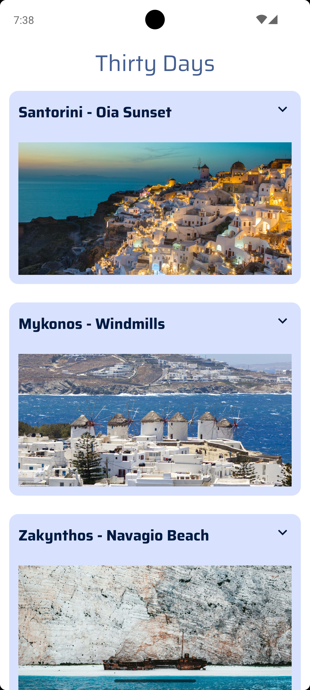
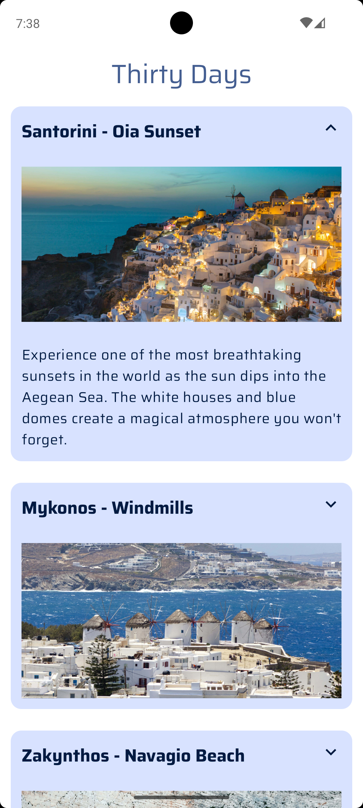
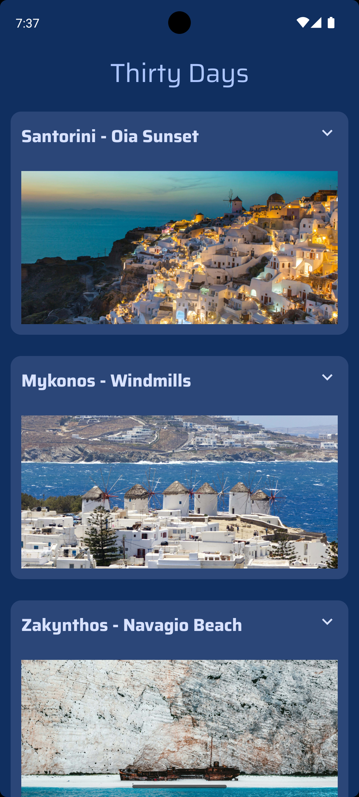
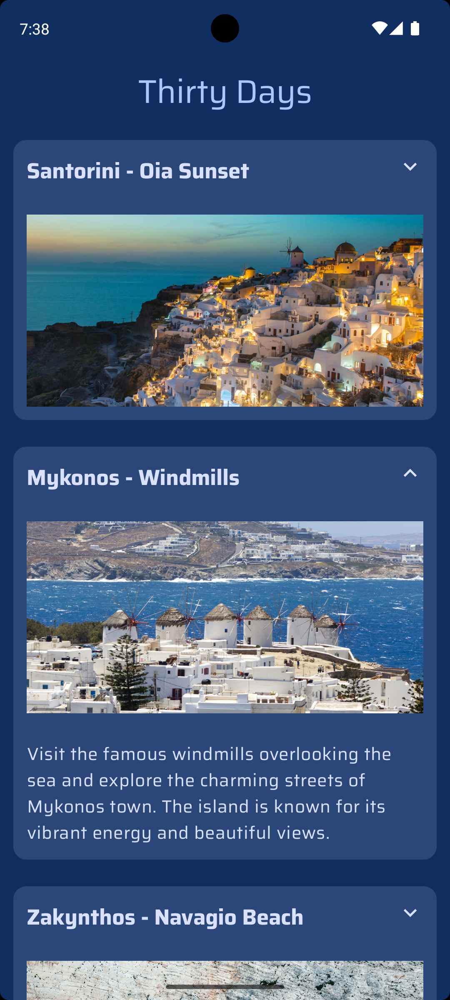

# 📱 ThirtyDays App

A modern Android application built with **Jetpack Compose** that presents 30 daily greek places using a clean UI, custom design system, and smooth animations.

---

## 📸 Screenshots

### ☀️ Light Mode

<p align="center">
  
  
</p>

### 🌙 Dark Mode

<p align="center">
  
  
</p>

## 🎬 Demo

<p align="center">
  
</p>

## 🎯 Project Overview

This app was created as part of a UI-focused project where the goal is to:

* Display **30 greek places (one for each day)**
* Use **images and text**
* Present content in a **scrollable list**
* Follow **Material Design guidelines**
* Build a **unique visual identity**

---

## ✨ Features

* 📜 **Scrollable List**

  * Implemented using `LazyColumn`
  * Efficient rendering of 30 items

* 🧩 **Card-based Layout**

  * Each day is displayed in a Material 3 `Card`
  * Includes:

    * Day title
    * Image
    * Description

* 🎬 **Animations**

  * Expandable cards
  * Smooth layout transitions with `animateContentSize()`
  * Rotating arrow icon using `animateFloatAsState`

* 🔽 **Interactive UI**

  * Click to expand/collapse descriptions
  * Visual feedback with animated arrow

---

## 🎨 Design & Theming

### 🌗 Light & Dark Theme

* Fully supports **Light and Dark mode**
* Automatically adapts to system settings

### 🎨 Color System

* Custom palette generated using **Material Theme Builder**
* Uses semantic roles:

```kotlin
MaterialTheme.colorScheme.primary
MaterialTheme.colorScheme.secondaryContainer
MaterialTheme.colorScheme.background
```

### 🔤 Typography

* Custom **Saira Font Family**
* Applied through `Typography` in `ui.theme`

### 🔷 Shapes & Material Design

* Rounded cards
* Clean spacing and padding
* Consistent Material 3 styling

---

## 🖼️ App Icon

* Custom app icon designed specifically for the app
* Reflects the theme and concept of the project
* Located in:

```id="iconpath"
res/mipmap/
```

---

## 🖼️ Images & Content

* Each card includes:

  * 📷 Image
  * 📝 Text description
* Content is **custom and relevant to the app theme**
* ⚠️ Only properly licensed or owned assets are used

---

## 🏗️ Tech Stack

* **Kotlin**
* **Jetpack Compose**
* **Material 3**
* **Compose Animations**
* **State management (`remember`, `mutableStateOf`)**

---

## 📂 Project Structure

```id="proj3"
com.example.thirtydays
│
├── model
│   ├── Place.kt
│   └── PlacesRepository.kt
│
├── ui.theme
│   ├── Color.kt
│   ├── Theme.kt
│   ├── Type.kt   // Saira font setup
│
├── MainActivity.kt
```

---

## 🚀 Core Implementation

### 🔹 LazyColumn (Scrollable List)

```kotlin
LazyColumn {
    items(places.size) { index ->
        PlaceItem(place = places[index])
    }
}
```

---

### 🔹 Expandable Card with Animation

```kotlin
var expanded by remember { mutableStateOf(false) }

Card(
    modifier = Modifier
        .clickable { expanded = !expanded }
        .animateContentSize()
)
```

---

### 🔹 Arrow Animation

```kotlin
val rotation by animateFloatAsState(
    targetValue = if (expanded) 180f else 0f
)
```

---

## 🧠 Material Design Considerations

* ✔ Color contrast using `colorScheme`
* ✔ Typography hierarchy with Saira font
* ✔ Consistent spacing and layout
* ✔ Rounded shapes for modern UI
* ✔ Smooth motion through animations

---

## 🧠 Learning Outcomes

Through this project, I learned:

* Building UIs with **Jetpack Compose**
* Creating a **custom Material 3 theme**
* Implementing **animations and interactions**
* Structuring a clean and scalable UI
* Applying **Material Design principles**

---

## 👨‍💻 Author

Created as part of learning modern Android development with Jetpack Compose.

---

## 📄 License

MIT License
